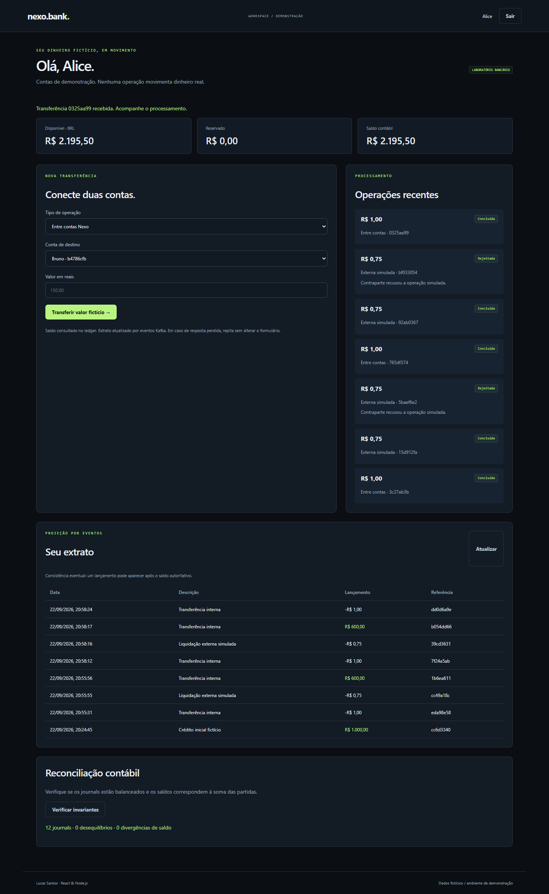
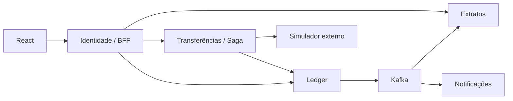

# Nexo Bank

Banco de demonstração com dinheiro fictício: ledger de partidas dobradas, saga persistida, Kafka e Kubernetes local.

[](https://github.com/Lucass-Gs/nexo-bank/actions/workflows/ci.yml)

Projeto de portfólio em React, TypeScript e Node.js/NestJS. Versão funcional de demonstração, com dados fictícios e testes reproduzíveis.



## Executar com Docker

Requisitos: Docker Engine/Desktop em execução e Docker Compose v2. Node.js 24 é necessário apenas para desenvolvimento e testes locais.

```sh
git clone https://github.com/Lucass-Gs/nexo-bank.git
cd nexo-bank
docker compose up --build -d --wait
docker compose --profile tools run --rm seed
```

Abra http://localhost:4104. O seed pode ser executado novamente sem apagar dados. Use um perfil de navegador diferente para duas sessões simultâneas.

| Usuário fictício   | Senha local |
| ------------------ | ----------- |
| alice@example.test | Demo1234!   |
| bruno@example.test | Demo1234!   |
| carla@example.test | Demo1234!   |

A configuração padrão funciona sem arquivo .env. Para personalizar, copie .env.example para .env antes da primeira execução. Os valores publicados são exclusivamente credenciais locais de demonstração. As portas são expostas apenas em 127.0.0.1. Alterar a senha do PostgreSQL após inicializar o volume exige também alterar a credencial no banco.

## O que está implementado

- Seis processos NestJS: identidade/BFF, ledger, transferências, extratos, notificações e simulador externo; seis bancos com credenciais próprias.
- Ledger em centavos inteiros, partidas imutáveis, journals balanceados e locks contra gasto concorrente do mesmo saldo.
- Transferências idempotentes, reserva/captura/liberação e saga persistida. Timeout externo gera consulta/reconciliação antes de finalizar.
- Outbox/inbox Kafka, extrato com consistência eventual e notificações simuladas.
- Docker Compose, manifests Kubernetes com PVCs, probes, recursos e migrations; OpenTelemetry e Jaeger opcionais.

## Roteiro de demonstração

1. Entre como Alice e transfira um valor fictício para Bruno. Observe saldo e extrato.
2. Escolha contraparte externa: sucesso, recusa ou sucesso com resposta perdida. Observe a reconciliação do timeout.
3. Clique em Verificar invariantes: journals balanceados e saldo igual à soma das partidas.
4. Execute o teste de resiliência e acompanhe traces no Jaeger opcional.

## Arquitetura



O ledger mantém consistência forte; o extrato pode atrasar. Um timeout de rede não prova recusa: a saga consulta a contraparte usando a mesma identidade antes de capturar ou liberar a reserva. Não existe transação distribuída entre bancos. Outbox/inbox oferecem entrega pelo menos uma vez com efeitos deduplicados, não uma promessa de exactly-once na rede.

[Decisões técnicas](docs/DECISIONS.md) · [Operação e diagnóstico](docs/RUNBOOK.md) · [Validação](docs/VALIDATION.md) · [Kubernetes](docs/KUBERNETES.md)

## Testes

Com o Compose inicializado e o seed aplicado:

```sh
npm ci
npm run typecheck
npm run build
npm test
docker compose --profile test run --build --rm tests
npx playwright install chromium
npm run test:e2e

# Executar separadamente: interrompe temporariamente um serviço local
npm run test:resilience
```

No Windows, use npm.cmd se a política do PowerShell bloquear npm.ps1. O Playwright usa Microsoft Edge no Windows e Chromium no Linux. Testes de integração criam dados e operações fictícias; execute em ambiente de demonstração. O workflow GitHub Actions também cria o ambiente Docker e executa integração e navegador.

## Estrutura

- apps/api/src: API, autenticação, persistência e domínio.
- apps/web: interface React.
- db: migrations SQL e dados de demonstração no seed da API.
- tests: testes unitários, integração e navegador.
- infra: proxy e/ou configurações de infraestrutura.

## Limites e próximos passos

Ambiente didático de um nó, sem alta disponibilidade. Autenticação interna usa token compartilhado de demonstração; não há mTLS, NetworkPolicies, HPA, KMS nem integração bancária real. Não há DLQ Kafka para eventos inválidos nem replay administrativo completo; versões de contrato precisam ser compatíveis. Identidade e BFF compartilham um processo. Sem auditoria/certificação de sistema financeiro.

O código demonstra decisões técnicas; senioridade também depende de explicar os trade-offs, manter sistemas e colaborar com uma equipe.

## Autor

Lucas Santos · [LinkedIn](https://www.linkedin.com/in/lucass-gs/) · [GitHub](https://github.com/Lucass-Gs)
